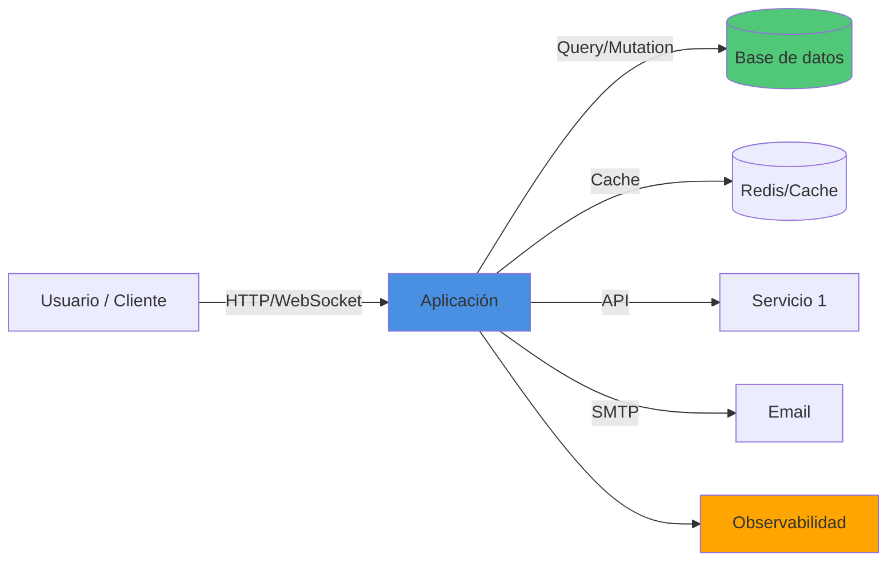

# spec-docs — Especificación y documentación del proyecto

Esta skill produce/actualiza **dos artefactos canónicos** y un **manifiesto de
entregables** que los conecta:

| Archivo | Rol | Audiencia |
|---|---|---|
| `PROMPT.md` | El **QUÉ**: contrato de especificación del producto | Humanos / product |
| `AGENTS.md` | El **CÓMO**: instrucciones operativas para agentes de código | Agentes / devs |

Regla rectora: **no dupliques contenido entre los dos.** `PROMPT.md` define
requisitos y criterios de aceptación; `AGENTS.md` define comandos, convenciones y
flujo de trabajo. Cada entregable de la lista aparece como *requisito* en
`PROMPT.md` y como *tarea operativa con comandos* en `AGENTS.md`.

## Cuándo usarla
- Al arrancar el proyecto (PROMPT.md redactado, CLAUDE.md vacío).
- Cuando cambie el alcance y haya que re-sincronizar la especificación.
- Antes de una entrega, para verificar que el manifiesto de entregables esté completo.

## Workflow

### Paso 0 — Leer el estado actual
1. Lee `PROMPT.md`, `CLAUDE.md` y `AGENTS.md` (si existe).
2. Lista la raíz del repo y detecta qué entregables ya existen (ver checklist abajo).
3. Si hay `package.json`, extrae el stack real (framework, scripts, dependencias)
   en vez de asumirlo. No inventes comandos: deriva los `scripts` reales.

### Paso 1 — Mejorar `PROMPT.md`
Preserva la intención original del PROMPT.md redactado y expándelo con
esta estructura:

```markdown
# [Nombre del proyecto] — Especificación

## 1. Objetivo
Una frase de producto + el problema que resuelve.

## 2. Alcance
- Incluido (MVP): ...
- Fuera de alcance (por ahora): ...

## 3. Stack tecnológico
- Backend / Frontend / Otros componentes
- Justifica cada elección en una línea.

## 4. Requisitos funcionales
RF-01 ... RF-NN (cada uno verificable y con criterio de aceptación).

## 5. Requisitos no funcionales (medibles)
Cada uno con su OBJETIVO numérico, porque luego se mide (ver §8):
- Latencia API p95 < X ms.
- Accesos concurrentes soportados ≥ N usuarios.
- Disponibilidad objetivo, RPO/RTO si aplica.

## 6. Modelo de datos
Descripción de estructuras, colecciones/tablas, índices previstos, tamaño estimado.

## 7. Entregables documentales (OBLIGATORIOS)
Tabla con estado de cada entregable del manifiesto (§ "Manifiesto" de la skill).

## 8. Métricas y observabilidad
Qué se mide, cómo se mide, y los umbrales de §5.

## 9. Deployment público
Entorno objetivo, dominio, secretos/variables, estrategia (ver AGENTS.md para comandos).

## 10. Criterios de aceptación del proyecto
Checklist de "hecho": todos los entregables presentes + tests en verde + CI en verde.
```

### Paso 2 — Generar `AGENTS.md`
Crea/actualiza `AGENTS.md` con instrucciones **operativas y ejecutables**. Las
instrucciones de **instalación, arranque del sistema y dependencias deben ir arriba
del todo y muy visibles** (en las primeras secciones, con bloques de comandos).
Usa la plantilla:

```markdown
# AGENTS.md — Guía operativa de [Nombre del proyecto]

> Especificación del producto: ver `PROMPT.md`. Este archivo es el "cómo".

## 🚀 Instalación (paso a paso)
```bash
# 1. Dependencias
npm install
# 2. Variables de entorno
cp .env.example .env   # configurar variables de entorno
```

## ▶️ Arranque del sistema
```bash
npm run dev     # desarrollo
npm run build && npm start   # producción
```

## ✅ Tests
```bash
npm test            # suite completa
npm run test:watch  # desarrollo
npm run test:cov    # cobertura
```
Política: cada RF de PROMPT.md tiene ≥1 test. PR sin tests no se mergea.

## 🧱 Estructura del proyecto
(árbol de carpetas y qué vive en cada una)

## 🧭 Convenciones
Estilo de código, naming, commits, manejo de errores.

## 📊 Métricas (cómo recolectarlas)
Comandos/endpoints para medir latencias, concurrencia
(p.ej. herramienta de carga), y dónde se registran (ver PROMPT.md §5/§8).

## 🌐 Deployment público
Pasos concretos, secretos, pipeline, rollback.

## 📒 Documentación viva (obligación del agente)
Tras cada cambio relevante: actualizar README/QUICKSTART si cambia el arranque,
registrar problemas+soluciones en RETROSPECTIVA.md.
```

### Paso 3 — Manifiesto de entregables
Inserta esta tabla **en PROMPT.md §7** y mantenla como fuente de verdad. Marca el
estado real detectado en el Paso 0.

| Entregable | Propósito | Estado |
|---|---|---|
| `README.md` | Visión general, instalación, arranque, arquitectura resumida | ⬜ |
| `QUICKSTART.md` | Camino mínimo "de cero a corriendo" en < 5 min | ⬜ |
| `RETROSPECTIVA.md` | Bitácora **problema → causa → solución** (entrada por incidente) | ⬜ |
| `REFLEXION-FINAL.md` | Cierre: qué se logró, decisiones, deuda técnica, aprendizajes | ⬜ |
| Tests automatizados | ≥1 por RF; unitarios + integración + e2e clave | ⬜ |
| `.env.example` | Plantilla de variables de entorno | ⬜ |
| `package-lock.json` | Dependencias bloqueadas (generado por `npm install`, commiteado) | ⬜ |
| Pipeline CI (`[.gitlab-ci.yml\|.github/workflows/*]`) | install → lint → test → build → deploy | ⬜ |
| Diagrama de arquitectura | En README (Mermaid): componentes y flujos | ⬜ |
| Sección de métricas | Latencias, tiempos de respuesta, tamaño de datos, concurrencia | ⬜ |
| Guía de deployment público | Detallada, reproducible, con secretos y rollback | ⬜ |

#### Generación de stubs
Para cada entregable documental que **no exista**, crea un **stub esqueleto** con
sus secciones y marcadores `TODO` / `<!-- TODO -->`, sin inventar contenido.
Nunca regeneres un archivo que ya tenga contenido real. Stubs a crear:
`README.md`, `QUICKSTART.md`, `RETROSPECTIVA.md`, `REFLEXION-FINAL.md`,
pipeline CI, `.env.example`. (`package-lock.json` no se stubea: lo genera `npm install`.)

### Paso 4 — Diagrama de arquitectura
El diagrama va en `README.md` con Mermaid. Debe mostrar **todos los componentes principales**
y cómo se comunican. Incluye:

- **Componentes de usuario**: navegador, cliente móvil, etc.
- **Capas de aplicación**: frontend, backend, API gateway, workers, crons.
- **Almacenamiento**: bases de datos, cachés, storage externo.
- **Servicios externos**: mail, pagos, autenticación, APIs terceros.
- **Observabilidad**: logs, métricas, tracing.
- **Infraestructura**: servidores, contenedores, CDN, balanceadores.

Estructura mínima recomendada:



**Checklist del diagrama**:
- [ ] Todos los datos flows están representados.
- [ ] Se muestran direcciones de comunicación (→ / ↔).
- [ ] Se etiquetan protocolos (HTTP, SQL, gRPC, etc.) si son relevantes.
- [ ] Se distinguen componentes internos (colores) de externos.
- [ ] Es legible y cabe en una sola pantalla (max 5-7 elementos principales).

### Paso 5 — Despliegue público
Define en `PROMPT.md §9` y `AGENTS.md` la estrategia **end-to-end** de deployment:

**En PROMPT.md §9 (qué)**:
- Entorno objetivo: `production`, `staging`, `demo`.
- Plataforma: cloud (AWS/GCP/Azure), VPS, on-premise, serverless.
- Dominio(s) y URL(s) de acceso.
- Estrategia de actualización: rolling, blue-green, canary.
- Ventana de maintenance y RPO/RTO esperado.
- Backup y disaster recovery.

**En AGENTS.md (cómo)**:
```bash
# Prerequisitos
- Variables de entorno producción en .env.production
- Secretos (keys, tokens) en gestor de secretos (Vault, AWS Secrets Manager, etc.)
- Base de datos producción aprovisionada
- Dominio DNS apuntando a la infraestructura

# Deployment manual
npm run build
npm run deploy:prod   # script que pushea a servidor/cloud

# Pipeline automático (CI/CD)
# Ver .gitlab-ci.yml / .github/workflows/
# En cada push a main: build → test → deploy

# Rollback
git revert <commit>
git push
# (o script manual de rollback)

# Verificación post-deployment
curl https://tudominio.com/health
# Revisar métricas en dashboard de observabilidad
```

**Secciones clave en AGENTS.md para deployment**:
1. **Secretos y configuración**: cómo se inyectan en cada entorno.
2. **Base de datos**: migraciones, aprovisionamiento, backups.
3. **Construcción**: build steps, artefactos generados, tamaño.
4. **Deployment**: comandos o script de deploy, pasos manuales si hay.
5. **Verificación**: health checks, smoke tests, dashboard de métricas.
6. **Rollback**: cómo revertir en caso de error.
7. **Monitoreo post-deploy**: qué alertas están configuradas y qué vigilar.

### Paso 7 — Métricas a prever para producción
PROMPT.md §5/§8 y AGENTS.md deben cubrir **como mínimo**:
- **Performance operativa**: throughput (req/s), uso CPU/memoria.
- **Latencias**: p50/p95/p99 de endpoints clave.
- **Tiempos de respuesta**: por operación crítica y por índice.
- **Tamaño de los objetos**: bytes por documento/entidad y por colección/tabla.
- **Accesos concurrentes**: usuarios/conexiones simultáneas soportadas y punto de degradación.
- **Otras útiles**: tasa de error, cold start, costo estimado, uptime.

## Criterios de calidad (auto-verificación antes de terminar)
- [ ] PROMPT.md mantiene la intención original y no contradice nada.
- [ ] PROMPT.md y AGENTS.md no se duplican (QUÉ vs CÓMO).
- [ ] Instalación y arranque están arriba y muy visibles en AGENTS.md.
- [ ] Cada métrica pedida tiene un objetivo numérico en PROMPT.md.
- [ ] El manifiesto refleja el estado REAL del repo (verificado, no asumido).
- [ ] Comandos derivados de `package.json` real, no inventados.
- [ ] Tras correr la skill, resumir al usuario qué falta del manifiesto.

## Repositorios y subida del proyecto

Una vez probado el proyecto y validado que:
- ✅ Pipeline CI/CD pasa sin errores
- ✅ Tests pasan al 100%
- ✅ Build genera artefactos sin errores
- ✅ Todos los entregables del manifiesto están presentes

El proyecto se subirá a los siguientes repositorios:

| Repositorio | URL |
|---|---|
| **GitHub** | `https://github.com/OSCARJORGERAPP/[nombreDelProyecto]` |
| **GitLab** | `https://gitlab.codecrypto.academy/ojrapp/[nombreDelProyecto]` |

**Requisitos antes de subir**:
- ⚠️ **`.gitlab-ci.yml` está presente y configurado** (pipeline CI/CD en GitLab).
- No hay errores en el pipeline (lint, test, build).
- Tests pasan completamente.
- Build genera sin warnings críticos.
- PROMPT.md, AGENTS.md y todos los documentos de entregables están completos.
- `.gitignore` está configurado (node_modules, .env, secrets, etc.).
- `package-lock.json` está commiteado.

**⚠️ SINCRONIZACIÓN OBLIGATORIA**: 
- **TODAS las correcciones, commits y cambios se suben a AMBOS repositorios**.
- GitHub y GitLab deben estar siempre en sincronía.
- No hay excepciones: un commit en uno debe estar en el otro.
- La fuente de verdad es el local; cada push a main/master se replica automáticamente en ambos remotes.
- Verificar que ambos repositorios reflejen el mismo estado después de cada push.

**⚠️ `.gitlab-ci.yml` ES OBLIGATORIO EN TODOS LOS PROYECTOS**:
- Presente desde el inicio del proyecto.
- Define la pipeline CI/CD completa: lint → test → build → deploy.
- Sin `.gitlab-ci.yml`, el proyecto no está completo.
- Debe ser efectivo (sin errores) antes de subir a los repositorios.
