# 🎯 Apuestas Deportivas — SaaS

Plataforma de apuestas deportivas con autenticación por magic link, pagos con REDSYS, y distribución proporcional de ganancias entre ganadores.

## ✨ Características principales

- 🔐 **Magic Link Auth**: Autenticación sin contraseña basada en JWT + MailHog
- 📊 **Gestión de apuestas**: CRUD completo, Admin puede crear y definir resultados
- 👥 **Participantes**: Registro automático y seguimiento
- 💰 **Valores apostados**: Predicciones (equipo1, equipo2, empate)
- 🎁 **Distribución de ganancias**: Cálculo proporcional automático
- 💳 **Pagos REDSYS**: Integración con pasarela (modo prueba)
- 🎨 **Diseño profesional**: Paleta gris/negra, responsive, Tailwind CSS
- 🧪 **Tests E2E**: Cobertura completa con Playwright (5 suites, 17 tests)
- 🚀 **Pipeline CI/CD**: GitLab CI (install → lint → test → build → deploy)

## 📋 Stack tecnológico

| Componente | Tecnología | Descripción |
|---|---|---|
| Frontend | React 18 + Next.js 14 | Full-stack app, SSR + static |
| Backend | Next.js API routes | RESTful, serverless-ready |
| DB | MongoDB nativo | Driver oficial, sin ODM |
| Auth | JWT + Magic Link | Flujo sin contraseña, 7 días exp |
| Email | MailHog (dev) | Captura local de emails |
| Pagos | REDSYS | Pasarela española (prueba) |
| Tests | Playwright E2E | 5 suites, 17 casos, headless |
| Styling | Tailwind CSS | Utility-first, tema oscuro |
| CI/CD | GitLab CI | 5 stages: install, lint, test, build, deploy |

## 📊 Arquitectura

```mermaid
flowchart LR
  U[👤 Usuario / Navegador] -->|HTTP/S| APP[🚀 Next.js App]
  APP -->|Magic Link| MAIL[📧 MailHog/SMTP]
  APP -->|Driver nativo| DB[(🗄️ MongoDB)]
  APP -->|XML/SOAP| REDSYS[💳 REDSYS Pasarela]
  APP --> LOGS[📝 Logs / Métricas]
  ADM[👨‍💼 Administrador] -->|/admin| APP
  
  style APP fill:#0f172a
  style DB fill:#15803d
  style MAIL fill:#ea580c
  style REDSYS fill:#1e40af
```



## 🚀 Inicio rápido (< 5 minutos)

```bash
# 1. Instalar dependencias
npm install

# 2. Arrange MongoDB & MailHog
docker run -d --name fact-mongo -p 27017:27017 mongo:7
docker run -d --name fact-mailhog -p 1025:1025 -p 8025:8025 mailhog/mailhog

# 3. Setup y seed
npm run db:setup
npm run seed

# 4. Correr dev
npm run dev

# 5. Abrir
# - App: http://localhost:3000
# - MailHog: http://localhost:8025
```

Ver [QUICKSTART.md](./QUICKSTART.md) para más detalles.

## 📁 Estructura del proyecto

```
apuestas-deportivas/
├── src/
│   ├── pages/              # Next.js pages & API routes
│   │   ├── index.jsx       # Landing (/)
│   │   ├── login.jsx       # Magic link request
│   │   ├── api/            # Backend
│   │   │   ├── auth/       # Magic link, verify, logout
│   │   │   ├── apuestas/   # CRUD apuestas + resultado
│   │   │   ├── participantes/
│   │   │   ├── valores/    # Valores apostados
│   │   │   ├── ganadores/  # Ganadores + distribución
│   │   │   └── pagos/      # REDSYS
│   │   ├── app/            # Rutas protegidas
│   │   │   ├── index.jsx   # Dashboard participante
│   │   │   └── apuesta/    # Detalle + apostar
│   │   └── admin/          # Panel admin
│   ├── lib/                # Utilities
│   │   ├── db.js           # MongoDB singleton
│   │   ├── auth.js         # JWT, middlewares
│   │   ├── mail.js         # MailHog/nodemailer
│   │   └── redsys.js       # REDSYS (placeholder)
│   ├── components/         # React components
│   │   ├── NavBar.jsx
│   │   ├── ApuestaCard.jsx
│   │   ├── ApuestaForm.jsx
│   │   ├── BetForm.jsx
│   │   └── StatsTable.jsx
│   └── styles/             # CSS global
├── scripts/
│   ├── db-setup.js         # Crear índices MongoDB
│   ├── seed.js             # Poblar datos de ejemplo
│   └── seed-reset.js       # Reset + re-seed
├── tests/e2e/              # Playwright tests
│   ├── auth.spec.js        # Magic link
│   ├── apuestas.spec.js    # Apostar
│   ├── admin.spec.js       # Panel admin
│   ├── ganadores.spec.js   # Distribución
│   └── reset.spec.js       # Reseteos
├── .gitlab-ci.yml          # Pipeline CI/CD
├── AGENTS.md               # Guía operativa
├── QUICKSTART.md
├── RETROSPECTIVA.md
└── REFLEXION-FINAL.md
```

## 🔌 API Endpoints

### Auth
- `POST /api/auth/request` → Magic link
- `GET /api/auth/verify?token=xxx` → Verificar
- `POST /api/auth/logout` → Logout

### Apuestas
- `GET /api/apuestas` → Todas
- `GET /api/apuestas/:id` → Detalle
- `POST /api/apuestas` → Crear (admin)
- `PUT /api/apuestas/:id` → Editar (admin)
- `PATCH /api/apuestas/:id/resultado` → Resultado (admin)
- `DELETE /api/apuestas/:id` → Eliminar (admin)

### Participantes, Valores, Ganadores
- Operaciones CRUD similares (GET, POST, PUT, DELETE)
- `/api/participantes`, `/api/valores`, `/api/ganadores`

### Pagos
- `POST /api/pagos/iniciar` → Formulario REDSYS
- `POST /api/pagos/callback` → Notificación REDSYS

### Health
- `GET /api/health` → Ping

## 🧪 Tests E2E

```bash
npm test              # Correr todos
npm run test:ui       # Interfaz gráfica
npm run test:debug    # Debug mode
```

**Cobertura:**
- ✅ Auth: magic link, verificación, logout
- ✅ Apuestas: crear, ver, participar, bloquear cerradas
- ✅ Admin: crear apuesta, resultado, participantes, reset
- ✅ Ganadores: cálculo, distribución proporcional, dashboard
- ✅ Reset: todas las colecciones

## 📊 Requisitos no funcionales

| Métrica | Objetivo | Medición |
|---|---|---|
| Latencia API p95 | < 200 ms | `npm run test:perf` |
| Disponibilidad | 99.9% | Uptime monitor |
| Concurrencia | ≥ 100 usuarios | Artillery load test |
| Tamaño doc | < 10 KB | Promedio MongoDB |

## 🌐 Deployment

Ver [AGENTS.md — Deployment público](./AGENTS.md#deployment-público).

Pasos:
1. Configurar `.env` con credenciales reales (REDSYS, MongoDB, etc.)
2. Ejecutar `npm run build`
3. Deployar a servidor/cloud con `npm start`
4. Configurar `.gitlab-ci.yml` para CI/CD automático

## 📚 Documentación adicional

- [QUICKSTART.md](./QUICKSTART.md) — Guía rápida de inicio
- [AGENTS.md](./AGENTS.md) — Referencia operativa completa
- [RETROSPECTIVA.md](./RETROSPECTIVA.md) — Bitácora de problemas/soluciones
- [REFLEXION-FINAL.md](./REFLEXION-FINAL.md) — Cierre y aprendizajes

## 🐛 Problemas conocidos & TODO

- [ ] REDSYS: implementar cifrado real (actualmente placeholder para pruebas)
- [ ] Magic Link: agregar resend si no recibe email
- [ ] Dashboard: agregar gráficos de histórico de apuestas
- [ ] Admin: agregar exportación de reportes (CSV)
- [ ] Performance: implementar caching de apuestas

## 📞 Soporte

Reportar issues en GitHub o GitLab.

---

**Última actualización:** 2026-06-22  
**Versión:** 1.0.0  
**Licencia:** Privada
